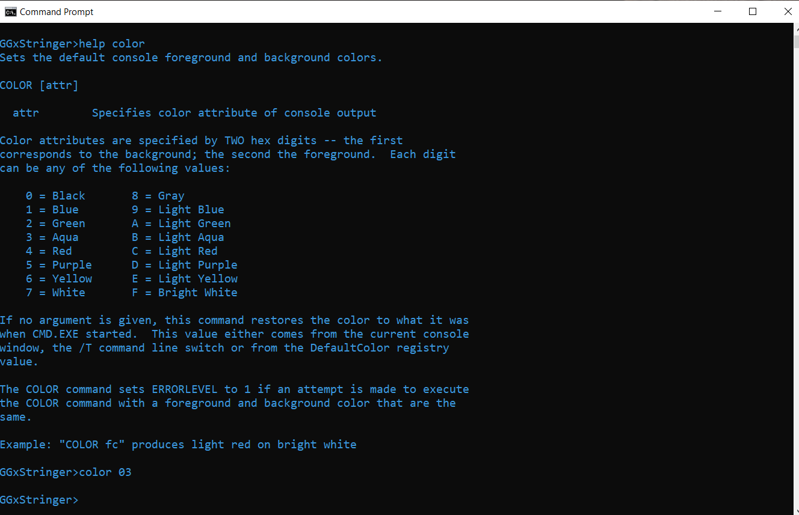
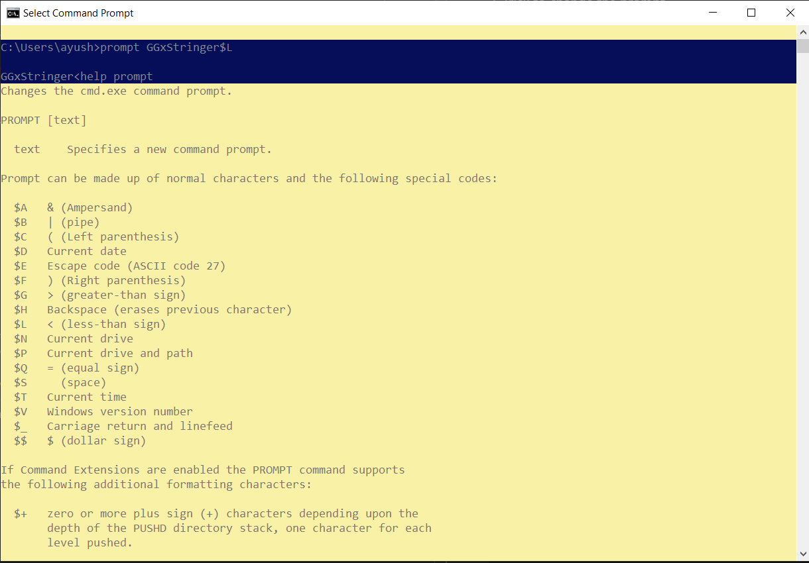
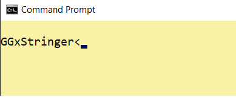
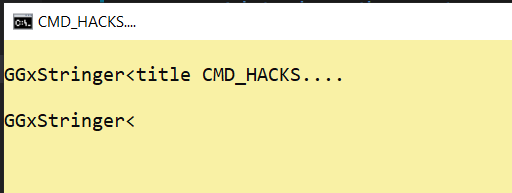
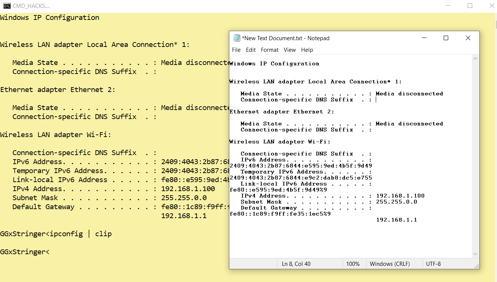

# CMD_Hacks

## *Here are some CMD codes which will attract you towards cmd and will make you to work along with it.*

### 1.  Trick to change Color
__Are you bored with the white color of the fonts ?__

    Change the color of the fonts by 
    --> color <color code>
    CHECK ALL THE COLOR CODES
    --> help color
    Ex:- color 03

### 2.  Trick to change the prompt
__Are you bored with the long prompts ? then change it!!__

    Change the prompt by
    --> prompt <anything>$<prompt_specialcode>
     CHECK ALL THE PROMPT BY
    --> help prompt 
    Ex:- prompt GGxStringer$G

### 3.  Trick to change the title
__Same title again again Lets change it!!__

    Change the title by
    --> title <name_of_the_title>
    Ex:- prompt GGxStringer$G

### 4.  Special trick to see the __Star Wars__ movie 
__This will blow U up your mind__
    
    Lets start the movie!!
    --> telnet towel.blinkenlights.nl
     Facing Isuse telnet not recognized!
     Enable the telnet feature....
     Start->Windows feature->search for telnet enable it
     try again the same code

### 5.  Trick to copy cmd codes to clipboard 
__Unable to Copy the stuff's of CMD try this!!__
     
    --> <cmd_code_to_copy> | clip
    Ex:- ipconfig | clip

### 6.  Trick to Zoom screen
__Tinny fonts are creating trouble ?__
__No worries!!__

    Zoom it up
    --> ctrl + mouse wheel

### 7.  Trick to Control Transperency of CMD screen
__Wanna hide your stff's try this!!__

    Transperency Enabled
    --> ctrl + shift + mouse wheel down
    Transperency Dissable
    --> ctrl+ shiht+ mouse wheel up

